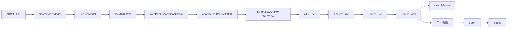
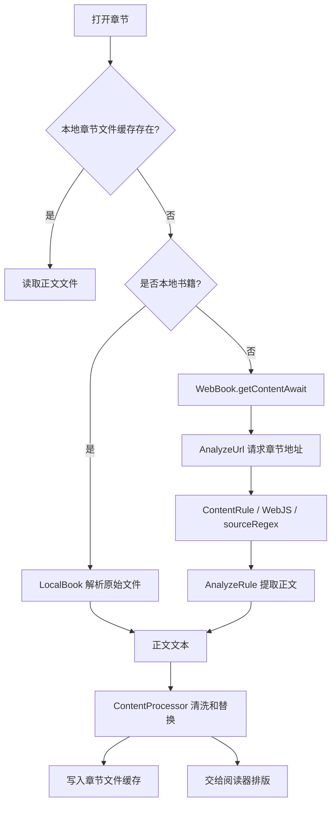

# Legado 核心业务对象与数据流原型设计文档

## 文档范围

本文档基于远程仓库 `Jingshiro/legado` 的 `main` 分支，描述书籍、书源、章节、阅读进度及其相关缓存的业务结构。

本文档只描述业务逻辑、对象关系、持久化边界和数据流，不描述 Kotlin、Room 或网络请求的具体实现。

## 一、核心业务对象

### 1. Book：书籍

持久化表：`books`

主键：`bookUrl`

来源文件：

- `app/src/main/java/io/legado/app/data/entities/Book.kt`
- `app/src/main/java/io/legado/app/data/entities/BaseBook.kt`

字段：

| 字段 | 业务含义 |
|---|---|
| `bookUrl` | 书籍详情页地址；本地书籍时表示本地文件路径 |
| `tocUrl` | 目录页地址 |
| `origin` | 书源地址或本地/远程文件来源标识 |
| `originName` | 书源名称或本地文件名 |
| `name` | 书名 |
| `author` | 作者 |
| `kind` | 书源返回的分类 |
| `customTag` | 用户自定义标签 |
| `coverUrl` | 书源返回的封面地址 |
| `customCoverUrl` | 用户自定义封面 |
| `intro` | 书源返回的简介 |
| `customIntro` | 用户自定义简介 |
| `charset` | 本地书籍使用的字符集 |
| `type` | 书籍类型位掩码，如文本、音频、图片、本地、视频 |
| `group` | 书架分组位掩码 |
| `latestChapterTitle` | 最新章节标题 |
| `latestChapterTime` | 最新章节信息更新时间 |
| `lastCheckTime` | 最近一次检查书籍更新时间 |
| `lastCheckCount` | 最近一次发现的新章节数量 |
| `totalChapterNum` | 目录总章节数 |
| `durChapterTitle` | 当前阅读章节标题 |
| `durChapterIndex` | 当前阅读章节索引 |
| `durVolumeIndex` | 当前卷索引 |
| `chapterInVolumeIndex` | 当前章节在卷内的索引 |
| `durChapterPos` | 当前章节内字符位置 |
| `durChapterTime` | 最近一次打开正文的时间 |
| `wordCount` | 书籍字数描述 |
| `canUpdate` | 是否允许书架刷新该书 |
| `order` | 书架手动排序值 |
| `originOrder` | 来源排序值 |
| `variable` | 书源规则运行时使用的自定义变量 |
| `readConfig` | 序列化保存的书籍级阅读配置 |
| `syncTime` | 最近一次同步时间 |
| `readIteration` | 阅读轮次；0 表示未完成，1 表示读完，之后表示重读轮次 |
| `addTime` | 加入书架时间 |
| `preReadNote` | 阅读前记录 |
| `finishTime` | 完读时间 |
| `postReadNote` | 完读感想 |
| `bookRating` | 0 到 5 星评分 |

`readConfig` 内含以下逻辑字段：目录倒序、翻页动画、重新分段、图片样式、是否使用替换规则、删除标签、TTS 引擎、长章节拆分、模拟阅读、模拟阅读起始日期/章节、每日章节数及音频播放参数。

不落库的运行时字段包括：规则变量映射、详情页 HTML、目录页 HTML、下载地址列表和缓存目录名。

书籍以 `bookUrl` 判断身份；`name + author` 建有唯一索引，用于重复书籍识别。

### 2. BookSource：书源

持久化表：`book_sources`

主键：`bookSourceUrl`

来源文件：

- `app/src/main/java/io/legado/app/data/entities/BookSource.kt`
- `app/src/main/java/io/legado/app/data/entities/BaseSource.kt`
- `app/src/main/java/io/legado/app/data/entities/BookSourcePart.kt`

字段：

| 字段 | 业务含义 |
|---|---|
| `bookSourceUrl` | 书源根地址和唯一标识 |
| `bookSourceName` | 书源名称 |
| `bookSourceGroup` | 书源分组 |
| `bookSourceType` | 文本、音频、图片、文件或视频类型 |
| `bookUrlPattern` | 详情页 URL 匹配规则 |
| `customOrder` | 用户手动排序 |
| `enabled` | 是否参与普通搜索和书架更新 |
| `enabledExplore` | 是否参与发现页 |
| `jsLib` | 书源公共 JavaScript 库 |
| `enabledCookieJar` | 是否自动保存请求 Cookie |
| `concurrentRate` | 并发和访问频率限制 |
| `header` | 默认请求头 |
| `loginUrl` | 登录地址 |
| `loginUi` | 登录页面配置 |
| `loginCheckJs` | 登录状态检测脚本 |
| `coverDecodeJs` | 封面解密脚本 |
| `bookSourceComment` | 书源说明和错误注释 |
| `variableComment` | 自定义变量说明 |
| `lastUpdateTime` | 书源最近更新时间 |
| `respondTime` | 书源响应时间统计 |
| `weight` | 智能排序权重 |
| `exploreUrl` | 发现页地址 |
| `exploreScreen` | 发现结果筛选规则 |
| `ruleExplore` | 发现页解析规则 |
| `searchUrl` | 搜索地址 |
| `ruleSearch` | 搜索结果解析规则 |
| `ruleBookInfo` | 书籍详情解析规则 |
| `ruleToc` | 目录解析规则 |
| `ruleContent` | 正文解析规则 |
| `ruleReview` | 段评相关规则 |
| `eventListener` | 是否启用事件回调规则 |
| `customButton` | 是否启用书源自定义按钮 |

书源规则对象以 JSON 字符串形式存储在 `book_sources` 的对应字段中：

- `SearchRule`：`checkKeyWord`、`bookList`、`name`、`author`、`intro`、`kind`、`lastChapter`、`updateTime`、`bookUrl`、`coverUrl`、`wordCount`
- `ExploreRule`：与 `SearchRule` 相同，但不包含校验关键字
- `BookInfoRule`：`init`、`name`、`author`、`intro`、`kind`、`lastChapter`、`updateTime`、`coverUrl`、`tocUrl`、`wordCount`、`canReName`、`downloadUrls`
- `TocRule`：`preUpdateJs`、`chapterList`、`chapterName`、`chapterUrl`、`formatJs`、`isVolume`、`isVip`、`isPay`、`updateTime`、`nextTocUrl`
- `ContentRule`：`content`、`subContent`、`title`、`nextContentUrl`、`webJs`、`sourceRegex`、`replaceRegex`、`imageStyle`、`imageDecode`、`payAction`、`callBackJs`
- `ReviewRule`：段评地址、头像规则、内容规则、发布时间规则、回复地址，以及点赞、发送和删除相关地址

`BookSourcePart` 是 `book_sources_part` 数据库视图，不是独立表。它只暴露书源列表所需的轻量字段，例如名称、分组、排序、启用状态、登录地址存在性、发现地址存在性、响应时间和类型。

### 3. BookChapter：章节

持久化表：`chapters`

联合主键：`(url, bookUrl)`

来源文件：

- `app/src/main/java/io/legado/app/data/entities/BookChapter.kt`

字段：

| 字段 | 业务含义 |
|---|---|
| `url` | 章节地址或本地章节标识 |
| `title` | 章节标题 |
| `isVolume` | 是否为卷标题节点 |
| `baseUrl` | 用于解析相对地址的基础地址 |
| `bookUrl` | 所属书籍地址，关联 `books.bookUrl` |
| `index` | 章节顺序索引 |
| `isVip` | 是否 VIP 章节 |
| `isPay` | 是否已购买 |
| `resourceUrl` | 音频真实资源地址 |
| `tag` | 更新时间或其他章节附加信息 |
| `wordCount` | 章节字数 |
| `start` | 本地文件章节起始位置 |
| `end` | 本地文件章节结束位置 |
| `startFragmentId` | EPUB 当前章节 Fragment ID |
| `endFragmentId` | EPUB 下一章节 Fragment ID |
| `variable` | 章节级规则变量 |
| `imgUrl` | 段评图片或视频封面 |

章节通过 `bookUrl` 外键从属于书籍，删除书籍时级联删除章节。`(bookUrl, index)` 具有唯一约束，保证同一本书内章节顺序唯一。

章节正文不作为 `chapters` 表字段保存，主要保存在文件缓存目录中；章节表保存目录元数据和正文缓存状态所需的信息。

### 4. BookProgress：阅读进度

`BookProgress` 不是 Room 实体，也没有独立表。

来源文件：

- `app/src/main/java/io/legado/app/data/entities/BookProgress.kt`

字段：

| 字段 | 业务含义 |
|---|---|
| `name` | 书名 |
| `author` | 作者 |
| `durChapterIndex` | 当前章节索引 |
| `durChapterPos` | 当前章节内位置 |
| `durChapterTime` | 最近阅读时间 |
| `durChapterTitle` | 当前章节标题 |

它是从 `Book` 提取出来的进度快照，用于进度同步、跨设备传输和 UI 展示。最终进度仍回写到 `books` 表中的 `durChapter*` 字段。

### 5. 相关对象

| 对象 | 表/视图 | 作用 |
|---|---|---|
| `BookGroup` | `book_groups` | 书架分组、排序、显示和刷新策略 |
| `SearchBook` | `searchBooks` | 搜索/发现结果的临时持久化对象，通过 `origin` 关联书源 |
| `Cache` | `caches` | Cookie、登录头、规则变量和其他键值缓存 |
| `Bookmark` | `bookmarks` | 书签及章节内位置 |
| `ReadRecord` | `readRecord` | 按设备和书名累计阅读时长 |
| `DetailedReadRecord` | `detailedReadRecords` | 详细阅读记录 |
| `ReplaceRule` | `replaceRules` | 正文和标题替换规则 |
| `BookThought` | `book_thoughts` | 选中文本、批注和想法 |
| `Cookie` | `cookies` | Cookie 持久化 |
| `SearchKeyword` | `search_keywords` | 搜索历史和使用次数 |

## 二、业务对象关系图

```mermaid
erDiagram
    BOOKS ||--o{ CHAPTERS : contains
    BOOK_SOURCES ||--o{ SEARCH_BOOKS : produces
    BOOKS ||--o{ BOOKMARKS : has_by_identity
    BOOKS ||--o{ BOOK_THOUGHTS : has_by_identity
    BOOK_SOURCES ||--o{ COOKIES : owns_by_domain
    BOOK_SOURCES ||--o{ CACHES : owns_by_key
    BOOK_GROUPS }o--o{ BOOKS : groups_by_bitmask
    BOOKS ||--o{ READ_RECORDS : records_by_name

    BOOKS {
        string bookUrl PK
        string tocUrl
        string origin FK
        string name
        string author
        int type
        long group
        int durChapterIndex
        int durChapterPos
        string readConfig
    }

    BOOK_SOURCES {
        string bookSourceUrl PK
        string bookSourceName
        bool enabled
        bool enabledExplore
        string searchUrl
        string ruleSearch
        string ruleToc
        string ruleContent
    }

    CHAPTERS {
        string url PK
        string bookUrl PK,FK
        string title
        int index
        bool isVolume
        string variable
    }

    SEARCH_BOOKS {
        string bookUrl PK
        string origin FK
        string name
        string author
        string tocUrl
    }

    BOOK_GROUPS {
        long groupId PK
        string groupName
        int order
        bool show
    }

    BOOKMARKS {
        long time PK
        string bookName
        string bookAuthor
        int chapterIndex
        int chapterPos
    }

    BOOK_THOUGHTS {
        long id PK
        string bookName
        string bookAuthor
        int chapterIndex
        int chapterPos
        string selectedText
    }

    READ_RECORDS {
        string deviceId PK
        string bookName PK
        long readTime
        long lastRead
    }

    CACHES {
        string key PK
        string value
        long deadline
    }

    COOKIES {
        string key PK
        string value
    }
}
```

关系说明：

- `Book` 与 `BookChapter` 是明确的数据库外键关系。
- `SearchBook.origin` 与 `BookSource.bookSourceUrl` 是明确的外键关系。
- `Book.origin` 逻辑上指向 `BookSource.bookSourceUrl`，但书籍也可以来自本地文件或 WebDAV，因此不是强制外键。
- `Book.group` 是位掩码，不是单独的关联表，因此书籍和分组之间是逻辑多对多关系。
- `Bookmark`、`BookThought` 和 `ReadRecord` 使用书名/作者或设备标识关联书籍，而不是使用 `Book.bookUrl` 外键。
- `Cache` 和 `Cookie` 通过键名、域名或书源地址建立逻辑关联。

## 三、网络到本地的完整数据流

### 1. 书源进入本地

书源可以来自内置数据、用户导入、规则订阅或远程 JSON。

业务过程：

1. 读取或解析书源 JSON。
2. 将普通字段和嵌套规则对象转换为 `BookSource`。
3. 对规则对象执行兼容性反序列化。
4. 按 `bookSourceUrl` 去重。
5. 写入 `book_sources`。
6. 通过 `book_sources_part` 视图向书源管理页面提供轻量列表。

### 2. 搜索书籍



搜索过程由 `SearchModel` 并发调度多个启用书源。每个书源通过 `searchUrl` 生成请求，`AnalyzeUrl` 处理 URL 参数、请求方法、请求头、Cookie、分页和登录检测。

响应正文交给 `AnalyzeRule`，根据 `SearchRule` 提取书名、作者、简介、分类、封面、详情页地址和字数，形成 `SearchBook`。

搜索结果会写入 `searchBooks`，用于结果合并、排序和后续详情加载。用户选中结果后，`SearchBook` 转换为 `Book` 并写入 `books`，正式进入书架或详情流程。

### 3. 获取书籍详情

1. 根据 `Book.origin` 找到 `BookSource`。
2. 使用 `Book.bookUrl` 创建详情页请求。
3. 通过 `AnalyzeUrl` 获取 HTML、JSON 或 WebView 结果。
4. 按 `BookInfoRule` 解析书名、作者、简介、封面、分类、最新章节和目录地址。
5. 更新 `Book` 的远程元数据字段。
6. 将详情页地址和目录页地址写回 `books`。

详情页 HTML 可以作为当前业务过程中的临时数据使用，但不属于 `books` 的持久化字段。

### 4. 获取目录

1. 使用 `Book.tocUrl` 或详情页产生的目录地址请求目录。
2. 执行 `TocRule.preUpdateJs`，为目录请求准备变量或临时状态。
3. 获取目录 HTML、JSON 或 WebView 内容。
4. 由 `AnalyzeRule` 根据 `chapterList` 提取章节集合。
5. 为每章解析标题、URL、卷标、VIP 状态、购买状态、更新时间和章节变量。
6. 生成 `BookChapter` 列表，并按 `index` 排序。
7. 按 `(url, bookUrl)` 写入或替换 `chapters`。
8. 更新 `Book.totalChapterNum`、最新章节标题和检查时间。

目录刷新时会根据旧章节标题、旧索引和新目录进行当前位置迁移，避免章节更新后阅读位置丢失。

### 5. 获取正文



正文链路包括：

- 优先读取 `BookHelp` 管理的章节文件缓存。
- 本地 TXT、EPUB、PDF、MOBI、UMD 由 `model.localBook` 处理。
- 在线章节由 `WebBook.getContentAwait` 获取。
- `AnalyzeUrl` 负责请求、Cookie、限速、重试、WebView 和 JavaScript。
- `ContentRule` 负责正文节点、子正文、下一页、图片、解密和付费操作。
- `ContentProcessor` 负责正文替换、去重标题、重新分段和格式清洗。
- 清洗前或清洗后的正文按书籍目录写入本地 `book_cache` 文件目录。
- 章节元数据仍保存在 `chapters`，正文文件本身不进入 `chapters` 表。

### 6. 阅读进度

1. 阅读器维护当前 `Book`、当前章节和页内位置。
2. 翻页或章节切换时更新 `durChapterIndex`、`durChapterPos`、`durChapterTitle`。
3. 阅读器退出、定时保存或同步时形成 `BookProgress` 快照。
4. 快照字段回写 `books`。
5. 其他设备或远程服务同步时，以书名、作者和章节信息辅助匹配新目录。
6. 目录变化后，通过章节标题相似度、章节序号和索引范围重新定位阅读位置。

## 四、文件路径清单

### 核心实体

- `app/src/main/java/io/legado/app/data/entities/Book.kt`
- `app/src/main/java/io/legado/app/data/entities/BookChapter.kt`
- `app/src/main/java/io/legado/app/data/entities/BookSource.kt`
- `app/src/main/java/io/legado/app/data/entities/BookSourcePart.kt`
- `app/src/main/java/io/legado/app/data/entities/BookProgress.kt`
- `app/src/main/java/io/legado/app/data/entities/BookGroup.kt`
- `app/src/main/java/io/legado/app/data/entities/SearchBook.kt`
- `app/src/main/java/io/legado/app/data/entities/Cache.kt`
- `app/src/main/java/io/legado/app/data/entities/Bookmark.kt`
- `app/src/main/java/io/legado/app/data/entities/ReadRecord.kt`
- `app/src/main/java/io/legado/app/data/entities/BookThought.kt`

### 书源规则对象

- `app/src/main/java/io/legado/app/data/entities/rule/BookListRule.kt`
- `app/src/main/java/io/legado/app/data/entities/rule/SearchRule.kt`
- `app/src/main/java/io/legado/app/data/entities/rule/ExploreRule.kt`
- `app/src/main/java/io/legado/app/data/entities/rule/BookInfoRule.kt`
- `app/src/main/java/io/legado/app/data/entities/rule/TocRule.kt`
- `app/src/main/java/io/legado/app/data/entities/rule/ContentRule.kt`
- `app/src/main/java/io/legado/app/data/entities/rule/ReviewRule.kt`

### 网络和规则处理

- `app/src/main/java/io/legado/app/model/analyzeRule/AnalyzeRule.kt`
- `app/src/main/java/io/legado/app/model/analyzeRule/AnalyzeUrl.kt`
- `app/src/main/java/io/legado/app/model/analyzeRule/AnalyzeByJSoup.kt`
- `app/src/main/java/io/legado/app/model/analyzeRule/AnalyzeByXPath.kt`
- `app/src/main/java/io/legado/app/model/analyzeRule/AnalyzeByJSonPath.kt`
- `app/src/main/java/io/legado/app/model/analyzeRule/AnalyzeByRegex.kt`
- `app/src/main/java/io/legado/app/model/webBook/WebBook.kt`
- `app/src/main/java/io/legado/app/model/webBook/SearchModel.kt`
- `app/src/main/java/io/legado/app/model/webBook/BookList.kt`
- `app/src/main/java/io/legado/app/model/webBook/BookInfo.kt`
- `app/src/main/java/io/legado/app/model/webBook/BookChapterList.kt`
- `app/src/main/java/io/legado/app/model/webBook/BookContent.kt`
- `app/src/main/java/io/legado/app/help/http/`
- `app/src/main/java/io/legado/app/help/webView/`
- `modules/rhino/`

### 阅读和本地书籍

- `app/src/main/java/io/legado/app/model/ReadBook.kt`
- `app/src/main/java/io/legado/app/model/localBook/`
- `app/src/main/java/io/legado/app/help/book/BookHelp.kt`
- `app/src/main/java/io/legado/app/help/book/ContentProcessor.kt`
- `app/src/main/java/io/legado/app/ui/book/read/`
- `app/src/main/java/io/legado/app/ui/book/read/page/`
- `app/src/main/java/io/legado/app/ui/book/read/page/delegate/`
- `modules/book/`

### 数据库和 DAO

- `app/src/main/java/io/legado/app/data/AppDatabase.kt`
- `app/src/main/java/io/legado/app/data/DatabaseMigrations.kt`
- `app/src/main/java/io/legado/app/data/dao/BookDao.kt`
- `app/src/main/java/io/legado/app/data/dao/BookChapterDao.kt`
- `app/src/main/java/io/legado/app/data/dao/BookSourceDao.kt`
- `app/src/main/java/io/legado/app/data/dao/BookGroupDao.kt`
- `app/src/main/java/io/legado/app/data/dao/SearchBookDao.kt`
- `app/src/main/java/io/legado/app/data/dao/CacheDao.kt`
- `app/src/main/java/io/legado/app/data/dao/BookmarkDao.kt`
- `app/src/main/java/io/legado/app/data/dao/ReadRecordDao.kt`
- `app/src/main/java/io/legado/app/data/dao/ReplaceRuleDao.kt`
- `app/src/main/java/io/legado/app/data/dao/BookThoughtDao.kt`
- `app/schemas/`

## 五、数据库表和视图清单

### 核心表

- `books`
- `book_sources`
- `chapters`
- `book_groups`
- `searchBooks`
- `caches`
- `bookmarks`
- `readRecord`
- `detailedReadRecords`
- `cookies`
- `replaceRules`
- `book_thoughts`

### RSS、订阅和扩展表

- `rssSources`
- `rssArticles`
- `rssReadRecords`
- `rssStars`
- `ruleSubs`
- `search_keywords`
- `txtTocRules`
- `dictRules`
- `httpTTS`
- `keyboardAssists`
- `servers`

### 数据库视图

- `book_sources_part`

该视图用于书源列表和筛选，来源于 `book_sources`，不保存独立数据。

数据库由 `AppDatabase` 管理，当前 Room 数据库版本为 99，数据库文件名为 `legado.db`。

## 六、原型设计结论

Rust + Flutter 重写时建议保留以下业务边界：

- `Book`、`BookChapter`、`BookSource` 是跨层共享的核心领域对象。
- `BookProgress` 应作为独立的同步 DTO，而不是数据库实体。
- 书源规则应作为结构化规则对象存储，规则执行器与 UI 解耦。
- `SearchBook` 是搜索阶段对象，不能直接等同于正式书架对象 `Book`。
- 章节元数据和正文内容应分离：章节进入数据库，正文进入文件或内容缓存。
- 阅读位置以 `bookUrl + chapterIndex + chapterPos` 为核心，但目录刷新时必须支持位置迁移。
- 书籍与书源是逻辑关联而非严格外键，因为本地书籍和 WebDAV 书籍没有普通书源。
- 书签、想法和阅读记录当前以书名/作者关联，迁移时应考虑增加稳定的 `bookUrl` 或内部书籍 ID。
- `BookSource` 的规则字段适合在 Rust 中作为规则领域层处理，Flutter 只负责编辑、展示和状态管理。

## 七、规则引擎与功能模块逻辑

### 7.1 规则引擎的总体模型

Legado 的规则不是一次性执行的单个表达式，而是一条有状态的处理链。

一条规则通常经历以下阶段：

1. 读取书源中的规则字符串。
2. 将普通选择器、JavaScript、WebView JavaScript 和正则片段拆分成有顺序的规则片段。
3. 为每个片段建立当前内容、书籍、章节、书源和 URL 上下文。
4. 执行片段前解析 `put` 变量和动态规则。
5. 根据片段类型提取或转换当前结果。
6. 对当前片段结果执行局部正则替换。
7. 将结果交给下一个片段继续处理。
8. 在最终输出阶段进行空值处理、HTML 实体解码、URL 补全或列表去重。

概念上的流程如下：

```text
原始响应
  -> 规则分段
  -> 当前上下文初始化
  -> put 变量处理
  -> 规则动态展开
  -> 当前规则执行
  -> 片段级替换
  -> 下一个规则片段
  -> 最终类型转换
  -> 业务对象字段
```

重要约束：规则片段的执行顺序不能改变。前一个片段产生的文本、节点、对象、数组或变量，可能是后一个片段的输入。

### 7.2 规则片段的通用执行流程

`AnalyzeRule` 同时支持返回单个字符串、字符串列表、单个对象和对象列表。它们共享规则链，但最终转换不同。

伪代码：

```text
function executeRule(ruleText, input, outputType):
    if ruleText is empty:
        return empty value for outputType

    parts = splitRule(ruleText)
    current = input

    for part in parts in original order:
        putValues = part.putMap
        for each name, valueRule in putValues:
            value = executeStringRule(valueRule, current)
            writeVariable(name, value)

        expandedRule = expandRuleWithCurrentContext(part.rule, current)

        if expandedRule is empty and part has no replacement:
            continue

        current = executeOnePart(part.mode, expandedRule, current)
        current = applyPartReplacement(current, part.replaceRegex)

    return convertResult(current, outputType)
```

规则链中的 `put` 不是普通的预处理配置，而是会在当前片段执行前产生副作用。变量写入后，后续 URL、CSS、XPath、JSONPath 或 JS 片段都可能读取它。

### 7.3 JsRule：普通 JavaScript 规则

这里的 JsRule 指直接在规则引擎脚本上下文中执行的 JavaScript 片段，原版主要由 Rhino 执行。

执行过程：

1. 当前规则片段被识别为 JavaScript。
2. 将当前结果作为 `result` 放入脚本上下文。
3. 注入书源、书籍、章节、Cookie、缓存和 URL 等对象。
4. 执行 JavaScript。
5. 将脚本返回值转换为字符串、列表、对象或对象列表。
6. 返回值作为下一个规则片段的输入。

伪代码：

```text
function executeJsRule(script, currentResult, context):
    bindings = createJsBindings(context)
    bindings.result = currentResult

    returned = sandbox.eval(script, bindings)

    if returned is undefined or null:
        return empty result according to caller
    return normalizeScriptValue(returned)
```

普通 JS 规则的返回类型非常重要：同一段脚本返回字符串时可以继续做文本提取，返回数组时可以继续逐项处理，返回对象时可以继续做键值访问。不能把所有返回值强制转换为字符串。

### 7.4 WebJsRule：后台 WebView JavaScript 规则

WebJsRule 与普通 JsRule 不同。它不是在纯脚本运行时中执行，而是在带有 DOM、页面 URL 和网页环境的后台 WebView 中执行。

适用场景：

- 页面必须执行浏览器 JavaScript 后才产生正文
- 规则需要访问 DOM
- 站点依赖浏览器环境、Cookie 或页面脚本
- 需要监听页面资源地址

执行过程：

1. 将当前 HTML 或当前结果序列化后传入后台 WebView。
2. 使用基础 URL 加载 HTML 或网页。
3. 注入原版网页扩展对象。
4. 等待页面完成加载。
5. 执行 WebJS 脚本。
6. 等待脚本返回非空结果。
7. 将 JavaScript 返回的 JSON 字符串解码为规则结果。
8. 将结果交回 `AnalyzeRule`，继续执行后续片段。

伪代码：

```text
function executeWebJsRule(script, currentResult, context):
    page = webView.load(
        url = context.baseUrl,
        html = context.content,
        headers = context.sourceHeaders,
        cookies = context.cookies
    )

    injectWebExtensions(page, context)
    returnedText = page.evaluateWhenReady(script, timeout)

    if returnedText is empty:
        raise WebJsTimeoutOrEmptyResult

    return decodeJsonOrText(returnedText)
```

WebJsRule 默认使用缓存优先的 WebView 页面环境，并且具有独立超时。它与普通 JS 规则不能互相替代：普通 JS 没有完整 DOM，WebJS 也不能假定拥有 Rhino 中的全部对象。

### 7.5 XPathRule

XPathRule 的输入可以是原始 HTML，也可以是前一个片段产生的节点集合。

执行过程：

1. 将当前内容转换成可查询的文档或节点。
2. 使用 XPath 查询节点、属性或文本。
3. 根据调用方式返回单值、列表或节点集合。
4. 使用基础 URL 或重定向后的 URL 补全链接。

伪代码：

```text
function executeXPathRule(xpath, current):
    document = ensureHtmlDocument(current)
    matched = xpath.select(document, xpath)

    if caller expects list:
        return mapToTextOrNodes(matched)
    if caller expects string:
        return firstOrEmptyText(matched)
    return matched
```

XPath 规则需要保留原版对文本节点、属性节点、空节点和多节点结果的处理方式。不能简单地用 CSS 选择器替代 XPath。

### 7.6 CSS/JSoupRule

普通规则片段默认按 JSoup/CSS 语义处理，除非规则前缀或规则状态明确要求其他模式。

执行过程：

1. 将字符串或节点转换为 HTML 查询对象。
2. 通过 CSS 选择器查找元素。
3. 根据规则尾部约定提取文本、属性或 HTML。
4. 在 URL 模式下将结果解析为绝对 URL。

伪代码：

```text
function executeCssRule(selector, current, extractionMode):
    document = ensureHtmlDocument(current)
    nodes = css.select(document, selector)

    if extractionMode is attribute:
        return readAttribute(nodes, attributeName)
    if extractionMode is html:
        return readInnerHtml(nodes)
    return readText(nodes)
```

原版对 HTML 实体的解码通常发生在字符串结果的最终阶段；因此解析阶段和最终字符串阶段不能混为一个步骤。

### 7.7 JsonPathRule

JsonPathRule 用于 JSON 接口书源。输入可能是 JSON 对象、数组、标量，或者前一条规则产生的 JSON 子对象。

执行过程：

1. 判断响应是否可以作为 JSON 使用。
2. 将当前输入转换为 JSON 值。
3. 执行 JSONPath 或对象键访问。
4. 处理单值、数组、空路径和嵌套对象。
5. 将结果保留为 JSON 类型，直到调用方要求转换成文本。

伪代码：

```text
function executeJsonPathRule(path, current, outputType):
    value = ensureJsonValue(current)
    matched = jsonPath.read(value, path)

    if outputType is string:
        return jsonValueToDisplayText(matched)
    if outputType is list:
        return flattenOrCollectArray(matched)
    return matched
```

JSON 对象和数组不能过早转换为字符串，否则后续 JSONPath、`put` 或 JS 规则会失去结构信息。

### 7.8 RegexRule

RegexRule 有两种主要用途：

- 从当前文本中提取一个值或多个值
- 对当前结果执行规则片段级替换

提取过程：

1. 将当前结果转换为文本。
2. 按原版规则语法拆分多个正则条件。
3. 查找匹配项和捕获组。
4. 按调用者需要返回第一个结果、所有结果或结构化对象。

替换过程：

```text
function applyRegexReplacement(text, rule):
    pattern = compile(rule.pattern)

    if pattern is invalid:
        return originalCompatibleFallback(text, rule)

    if rule.replaceFirst:
        match = findFirst(pattern, text)
        if match does not exist:
            return compatibleEmptyOrReplacementValue
        return replaceFirstMatch(match, rule.replacement)

    return replaceAll(text, pattern, rule.replacement)
```

正则替换发生在对应规则片段执行后，而不是统一延迟到整条规则结束后。正则编译失败、没有匹配和替换结果为空必须分别处理。

### 7.9 URL 规则和请求级 JavaScript

书源规则中的 URL 不只是地址，也可能包含请求描述。URL 处理需要先解析以下信息：

- 请求方法
- 字符集
- 请求头
- 请求体
- 来源 URL
- 重试次数
- 是否使用 WebView
- WebView JavaScript
- URL 计算脚本
- 响应体处理脚本
- 自定义 DNS/IP
- WebView 等待时间

概念流程：

```text
function requestByRule(urlRule, context):
    option = parseUrlOption(urlRule)
    url = resolveTemplate(option.url, context)

    if option.js exists:
        url = evalUrlScript(option.js, url, context)

    request = buildRequest(
        method = option.method,
        headers = mergeHeaders(context.source, option.headers),
        body = option.body,
        cookies = resolveCookies(context)
    )

    response = executeHttpOrWebView(request, option)

    if option.bodyJs exists:
        response.body = evalBodyScript(option.bodyJs, response.body, context)

    return response
```

### 7.10 规则执行上下文

每次规则执行都有一个有状态的 `AnalyzeRule` 上下文。上下文至少包含以下内容：

#### 内容状态

- 当前 HTML、JSON、文本、节点、对象或数组
- 基础 URL
- 重定向后的 URL
- 当前规则名称
- 当前规则模式

#### 业务对象

- 当前书源 `source`
- 当前书籍 `book`
- 当前章节 `chapter`
- RSS 场景下的当前文章对象
- 当前章节的下一章节 URL

#### 请求状态

- 搜索关键词 `key`
- 页码 `page`
- 书源请求头
- Cookie
- 当前请求和响应信息
- 书源共享作用域
- 协程或任务上下文

#### 规则辅助对象

- `java`：规则宿主扩展对象
- `cache`：缓存访问对象
- `cookie`：Cookie 访问对象
- `baseUrl`：当前基础 URL
- `result`：当前 JS 规则输入
- `source`：当前书源对象
- `book`：当前书籍对象
- `infoMap`：发现页或书源上下文附加信息
- `speakText`、`speakSpeed`：朗读相关上下文

### 7.11 变量作用域链

规则变量不是只有一个全局 Map。读取时遵循业务对象优先的层次：

```text
读取变量(name):
    if name == "bookName" and currentBook exists:
        return currentBook.name

    if name == "title" and currentChapter exists:
        return currentChapter.title

    if currentChapter has variable(name):
        return currentChapter.variable(name)

    if currentRuleData has variable(name):
        return currentRuleData.variable(name)

    return empty string
```

写入时遵循章节优先、业务对象兜底的规则：

```text
写入变量(name, value):
    if currentChapter exists:
        currentChapter.variable(name) = value
    else if currentRuleData exists:
        currentRuleData.variable(name) = value
```

书源级共享 JavaScript 作用域位于脚本运行时的上层。它可以被同一书源的多个规则执行共享，但不能把一个书源的变量泄漏到另一个书源。

大变量不应强行塞进普通数据库字段。原版会将书籍级、章节级和 RSS 级大变量放入外部规则数据存储，并使用书籍地址、章节地址和变量名进行隔离。

### 7.12 JS 沙箱交互接口

#### 普通 JS 沙箱

普通 JS 的调用方式可以抽象为：

```text
function callScript(script, context, input):
    scope = createRuntimeScope()
    scope.java = ruleHost
    scope.baseUrl = context.baseUrl
    scope.cookie = cookieStore
    scope.cache = cacheManager
    scope.page = context.page
    scope.key = context.keyword
    scope.book = context.book
    scope.source = context.source
    scope.result = input
    scope.infoMap = context.infoMap

    if context.sourceSharedScope exists:
        scope inherits context.sourceSharedScope

    return sandbox.evaluate(script, scope)
```

`java` 是脚本与宿主业务之间的主要桥梁。它负责提供 AJAX、变量读写、日志、URL 处理、缓存、Cookie、书籍操作和部分阅读器相关能力。实际可用方法必须以原版公开给脚本的扩展接口为准。

#### WebView JS 沙箱

WebView JS 的交互多了一层页面环境：

```text
function callWebScript(script, html, context, input):
    page = createBackgroundWebView()
    page.setBaseUrl(context.baseUrl)
    page.setHtmlOrLoadUrl(html, context.url)
    page.setHeaders(context.headers)
    page.setCookies(context.cookies)

    inject("cache", cacheBridge)
    inject("source", context.source)
    inject("java", webViewExtension)

    page.waitUntilLoaded()
    rawReturn = page.evaluate(script)
    return decodeWebViewReturn(rawReturn)
```

WebView 脚本的返回值通常经过 JSON 字符串化，再由规则引擎恢复成字符串、数组或对象。返回 `null`、空字符串或脚本持续不返回结果时，应按原版超时和空结果行为处理。

#### URL 级脚本

URL 级脚本的输入输出不同：

- URL 计算脚本：输入是解析中的 URL，输出成为最终请求 URL。
- Body 处理脚本：输入是 HTTP 响应体，输出成为后续规则解析的响应体。
- WebView 脚本：输入是网页环境或待执行的页面，输出是页面结果或嗅探到的资源地址。

不能把这三类脚本全部当成正文解析脚本执行。

### 7.13 错误处理行为

错误处理必须区分“空结果”“规则失败”“网络失败”“脚本超时”和“任务取消”。

#### 空规则和空输入

- 空字符串规则通常返回空字符串、空列表或空对象结果。
- 空规则数据不应被误判为成功解析。
- `AnalyzeRule` 收到空内容属于调用错误，应产生明确异常。
- 空章节正文不能默认写入成功缓存。

#### 解析错误

解析器无法匹配时通常返回空值或空集合，让上层决定是否继续尝试其他路径。解析器不得把异常文本伪装成正常书名、章节或正文。

#### 正则错误

正则编译失败需要记录诊断信息，并遵循原版兼容回退行为。不能因为新引擎更严格，就直接改变旧书源的结果。

#### JavaScript 错误

脚本异常、脚本返回类型错误和 WebView 超时必须保留错误上下文，包括书源、规则名称、页面类型和当前 URL。登录检测脚本失败时，原版可能会再次使用错误响应执行登录检查，因此不能简单地立即吞掉异常。

#### 网络错误

网络层应区分超时、域名不存在、连接拒绝、Socket 错误、TLS 错误、取消和其他错误。测试模式可以把网络错误转换成带错误码的响应对象，正常阅读流程则应向上抛出，让业务层决定重试、跳过或展示错误。

#### 任务取消

用户取消搜索、切换书籍或页面销毁造成的取消，不应被当作普通失败写入日志、缓存或阅读记录。取消必须继续向上传播，并阻止旧任务覆盖新会话状态。

### 7.14 日志行为

日志同时服务于普通运行、书源调试和错误定位。

普通运行日志关注：

- 请求开始和结束
- 书源名称或地址
- 解析阶段
- 结果数量
- 响应时间
- 失败原因

书源调试日志按阶段输出：

```text
开始解析搜索页
搜索页解析完成
开始解析详情页
详情页解析完成
开始解析目录页
目录页解析完成
开始解析正文页
正文页解析完成
```

日志状态通常包含：

- 普通进度状态
- `-1`：失败
- `1000`：整条调试链完成

规则日志还应记录：

- 当前规则名称
- 当前规则类型
- 当前 URL
- 当前输入摘要
- 当前输出摘要
- 变量写入和读取异常
- WebView 控制台错误
- 规则解析失败

日志不得默认完整输出 Cookie、密码、登录令牌或敏感请求头。调试模式可以展示必要的脱敏信息，但不能把原始认证信息写入普通日志。

对格式不规范但可兼容处理的规则，原版会记录一次提示并继续尝试解析。Rust 方案应保留“提示但继续”的行为，而不是直接中止。

### 7.15 书源业务对象的调用链

搜索、发现、详情、目录和正文共享规则引擎，但入口规则和最终对象不同：

```text
搜索:
    SearchRule
    -> AnalyzeUrl
    -> 响应获取
    -> AnalyzeRule
    -> BookList
    -> SearchBook

发现:
    ExploreRule
    -> AnalyzeUrl
    -> 响应获取
    -> AnalyzeRule
    -> BookList
    -> SearchBook

详情:
    BookInfoRule
    -> AnalyzeUrl
    -> 响应获取
    -> AnalyzeRule
    -> BookInfo
    -> Book

目录:
    TocRule
    -> preUpdateJs
    -> AnalyzeUrl
    -> 响应获取
    -> AnalyzeRule
    -> BookChapterList
    -> BookChapter 列表

正文:
    ContentRule
    -> AnalyzeUrl
    -> HTTP/WebView 响应
    -> AnalyzeRule
    -> 正文拼接和下一页
    -> ContentProcessor
    -> 阅读器输入
```

### 7.16 对 Rust 开发方案的行为边界

下一阶段 Rust 模块设计应以行为边界为单位，而不是直接按 Kotlin 文件逐个翻译。至少应拆分为：

- 规则字符串分段器
- 规则执行上下文
- HTML/CSS/JSoup 适配器
- XPath 适配器
- JSONPath 适配器
- 正则提取和替换器
- 普通 JS 沙箱桥接器
- WebView JS 边界适配器
- URL 规则解析器
- HTTP 请求和响应处理器
- Cookie 和缓存上下文
- 搜索、发现、详情、目录、正文业务编排器
- Debug/AppLog 兼容日志层

每个模块都必须先通过原版输入输出对比，再确定 Rust 内部数据结构。尤其不能先把所有规则结果统一成字符串，也不能先把所有脚本统一成无状态函数，否则会破坏对象、数组、变量和共享作用域行为。
